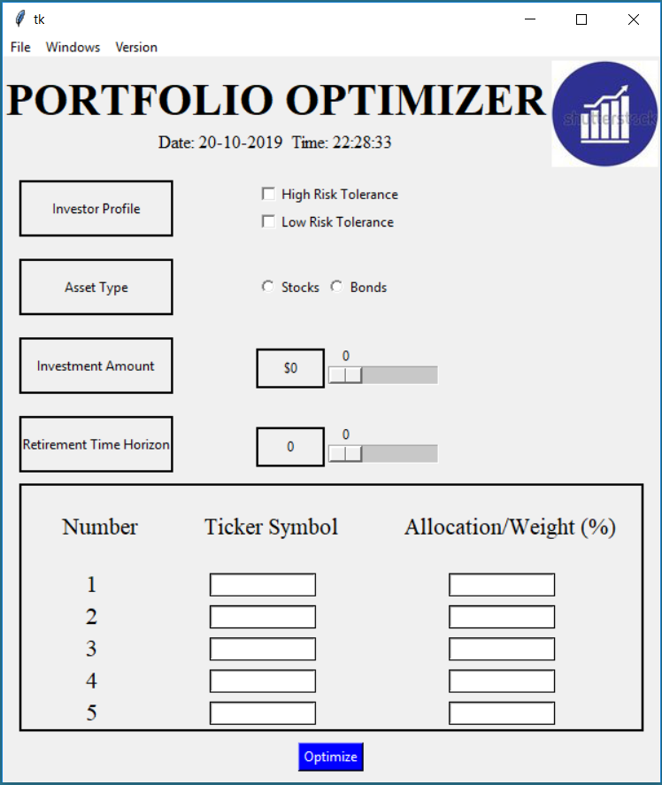
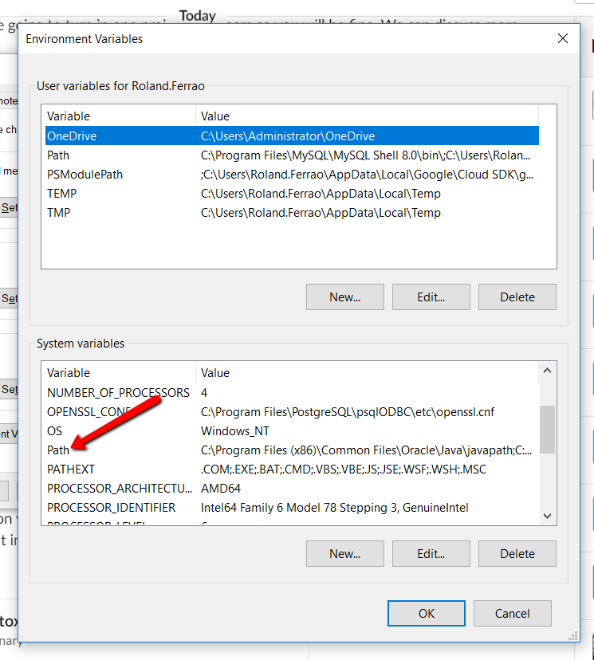

# Portfolio Optimizer (PO)
      

## Portfolio optimizer suggest an ideal allocation of stocks within your portfolio
* PO provides a portfolio analysis based on investor profile, investment amount, investment time horizon and stock selection
* Calculations includes 20 years of historical stock data
* One can input any different combinations of stocks and run the optimizer multiple times to get different reports within the reports folder
* Below is a screenshot of the user interface:

## How it works
1. Clone the repo to your local drive
2. From your terminal locate the code folder within the repo and within your terminal type '''python main.py''' <Hit Run>
3. Once you hit Run the PO pops up. Select Investor Profile, asset type (stocks), investment amount, investment time horizon, and enter stock and allocation details
4. Hit Optimize once all the details are entered and the PO will run all the anlalysis on the backed to generate a report in the report folder
5. Each report is time_stamped so generate as many reports you want with different portfolios

## Usage
The optimimzer can be used by analysts who want to do a quick discovery on basic stats and graphs as well as investors who want to understand what is the best allocation of their stock portfolio based on customized inputs
The portfolio analysis report has the below sections:
* **Portfolio Overview**: Analyzes historical data to provide confidence interval for returns based on current investment amount over the investment horizon. Besides that one can check for basic graphs (e.g. Box plots, histograms, correlation matrices)
* **Portfolio Analysis**: Suggests an optimal allocation for your portfolio based on your selected risk level. In addition the portfolio optimizer provides annualized returns and volatility on individual stocks within the portfolio    

## Requirements and Configuration
* All requirements and dependencies are in the code/requirements folder 
* The only other configuration is to run the wkhtmltox-0.12.5-1.msvc2015-win64.exe file in the code/archives folder
* Once the config is run the user needs to add the path to their System - path variable. Below is an image of where one could find that:

Have fun with the portfolio optimizer! :+1:

## Disclaimer
Developers of the PO are not registered as a securities broker-dealer or an investment adviser either with the U.S. Securities and Exchange Commission (the “SEC”) or with any state securities regulatory authority. We are neither licensed nor qualified to provide investment advice. Use PO suggestions at your own discretion